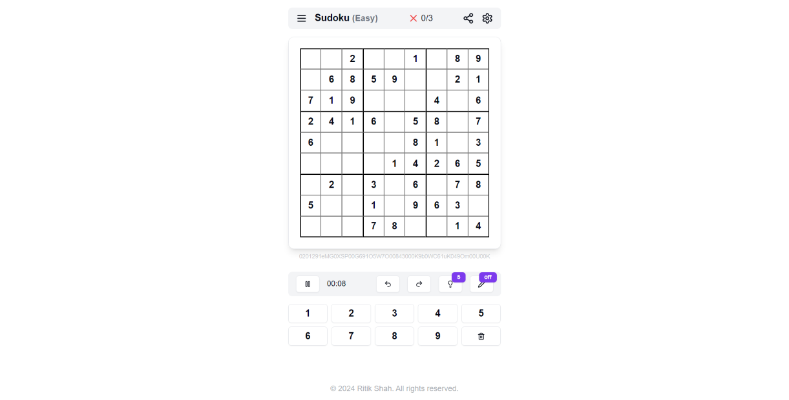

# Sudoku Challenge

An interactive Sudoku puzzle game built with Next.js 14, TypeScript, and Tailwind CSS. Play directly in the browser, share puzzles with friends via a unique code or link, and track your performance across four difficulty levels.

**Live demo:** [sudoku-ritikshah.vercel.app](https://sudoku-ritikshah.vercel.app)



---

## Features

- **Four difficulty levels** — Easy, Medium, Hard, and Expert, each with genuinely distinct puzzle complexity
- **Puzzle sharing** — every game generates a compact Base64 code; share a direct URL and anyone loads your exact puzzle
- **Hint system** — reveals a correct cell with a configurable limit and a +30s time penalty per use
- **Undo / Redo** — full move history for the current game
- **Mistake tracking** — configurable maximum mistakes (default 3) before game over
- **Timer** — counts up during play, pauses automatically when Settings or Share dialogs are open
- **Dark / light mode** — system preference respected, manually toggleable in Settings
- **Keyboard support** — press 1–9 to fill a selected cell, Backspace/Delete to clear
- **Configurable highlighting** — same row/column/box, same number, and conflicting cells
- **Fully responsive** — works on mobile, tablet, and desktop

---

## Tech Stack

| Layer | Choice |
|---|---|
| Framework | Next.js 14 (App Router) |
| Language | TypeScript |
| Styling | Tailwind CSS v3 + shadcn/ui |
| Animations | Framer Motion |
| Puzzle generation | `sudoku-gen` |
| QR codes | `qrcode` (dynamic import) |
| Icons | Lucide React |
| Deployment | Vercel |

---

## Getting Started

### Prerequisites

- Node.js 18+
- npm, yarn, pnpm, or bun

### Installation

```bash
git clone https://github.com/Ritiksh0h/sudoku.git
cd sudoku
npm install
```

### Development

```bash
npm run dev
```

Open [http://localhost:3000](http://localhost:3000) in your browser.

### Production build

```bash
npm run build
npm run start
```

---

## Project Structure

```
src/
├── app/
│   ├── page.tsx              # Landing page
│   ├── play/
│   │   └── page.tsx          # Game page — all game state lives here
│   ├── tutorial/
│   │   └── page.tsx          # How-to-play guide
│   ├── layout.tsx
│   └── globals.css
├── components/
│   ├── game-board.tsx         # 9×9 grid with highlighting logic
│   ├── game-controls.tsx      # Timer, pause, undo/redo, hint button
│   ├── number-pad.tsx         # Clickable 1–9 pad + delete
│   ├── game-end.tsx           # Win/lose dialog
│   ├── Navbar.tsx             # Difficulty menu, mistakes counter, settings, share
│   ├── Settings.tsx           # Settings dialog (timer, hints, highlighting, theme)
│   ├── share-dialog.tsx       # Share via code, link, QR code, or social
│   ├── Footer.tsx
│   └── ui/                    # shadcn/ui components
├── lib/
│   ├── sudoku.ts              # Puzzle generation, validation, board types
│   ├── sudokuEncoder.ts       # Base64 encode/decode for puzzle sharing
│   └── utils.ts
├── config/
│   └── siteConfig.ts          # Site metadata
└── hooks/
    └── use-toast.ts
```

---

## How Puzzle Sharing Works

Every puzzle is encoded as a compact Base64 string containing the puzzle grid, its solution, and the difficulty level — separated by `|` delimiters:

```
base64( puzzleString | solutionString | difficultyCode )
```

This string is appended to the URL as `?code=...`. Anyone who opens that URL loads the exact same board. The encoder/decoder lives in `src/lib/sudokuEncoder.ts`.

---

## Keyboard Shortcuts

| Key | Action |
|---|---|
| `1` – `9` | Fill selected cell |
| `Backspace` / `Delete` | Clear selected cell |
| Click a cell | Select it |

---

## Configuration

Game settings are managed in the Settings dialog and stored in React state for the current session:

| Setting | Default | Description |
|---|---|---|
| Display timer | On | Show/hide the elapsed time counter |
| Limit hints | On | Cap the number of hints per game |
| Number of hints | 5 | Hints available per game (when limited) |
| Highlight row/col/box | On | Highlight related cells on selection |
| Highlight same number | On | Highlight matching numbers across the board |
| Highlight conflicts | On | Highlight cells that violate Sudoku rules |
| Max mistakes | 3 | Mistakes before game over |

---

## Contributing

1. Fork the repository
2. Create a feature branch: `git checkout -b feature/your-feature`
3. Commit your changes: `git commit -m 'Add your feature'`
4. Push the branch: `git push origin feature/your-feature`
5. Open a Pull Request

Bug reports and feature requests are welcome via [GitHub Issues](https://github.com/Ritiksh0h/sudoku/issues).

---

## Author

**Ritik Shah** — [ritikshah.vercel.app](https://ritikshah.vercel.app)

---

## License

MIT License. See [LICENSE](LICENSE) for details.